# Sarampión en México

El sarampión es una enfermedad viral altamente contagiosa causada por un virus del género *Morbillivirus*. Se transmite principalmente a través de gotitas en el aire al toser o estornudar.

Sus síntomas comienzan con fiebre alta, tos seca, secreción nasal y ojos enrojecidos, seguidos de una erupción rojiza que se extiende por todo el cuerpo. Aunque suele afectar principalmente a niños, puede presentarse a cualquier edad y provocar complicaciones en algunos casos.

En este repositorio se encuentran scripts y conjuntos de datos para analizar la incidencia de esta enfermedad en México.

Los datos provienen de la Secretaría de Salud: [https://www.gob.mx/salud/documentos/datos-abiertos-152127](https://www.gob.mx/salud/documentos/datos-abiertos-152127)

## Contexto histórico

Durante décadas, la propagación del sarampión se ha mantenido bajo control gracias a las altas tasas de vacunación. o obstante, entre 2025 y 2026, México ha enfrentado un brote significativo que, inicialmente concentrado en ciertos estados, ha llegado a reportar casos en todo el territorio nacional.

El contenido de este repositorio ayudará a entender esta situación desde varios ángulos.

## Contenido

* **`descriptivo.py`**: Script para generar análisis descriptivos y gráficas, incluyendo:

  * Curva epidemiológica del sarampión.
  * Tasas de vacunación.
  * Tasas de incidencia por edad y sexo.
  * Evolución de los casos, mostrando el desenlace de cada caso confirmado.
  * Modelado de riesgo.

* **`geografico.py`**: Script para generar visualizaciones geográficas y tablas de incidencia, incluyendo:

  * Mapas coropléticos a nivel nacional, estatal y municipal.
  * Tablas con valores absolutos o tasas por entidad y a nivel nacional.

* **`assets/`**: Carpeta que contiene archivos GeoJSON para generar los mapas, así como datos de población y un diccionario para las variables.

* **`data/`**: Carpeta que incluye los conjuntos de datos correspondientes a los años 2020-2026, todos en formato CSV.

* **`requirements.txt`**: Archivo que lista las librerías necesarias para ejecutar los scripts.

## Análisis descriptivo

Las siguientes visualizaciones son generadas con los scripts antes mencionados. Todas las gráficas pueden configurarse para mostrar los datos de un año específico o de múltiples años, reflejando que el brote de sarampión se considera un fenómeno continuo debido a su naturaleza excepcional.

### Incindencia temporal

El análisis comienza con la incidencia semanal de casos confirmados de sarampión por laboratorio.

Para esta gráfica de barras, definimos cada semana como el periodo de lunes a domingo. Esta decisión se tomó para facilitar la interpretación al público general.

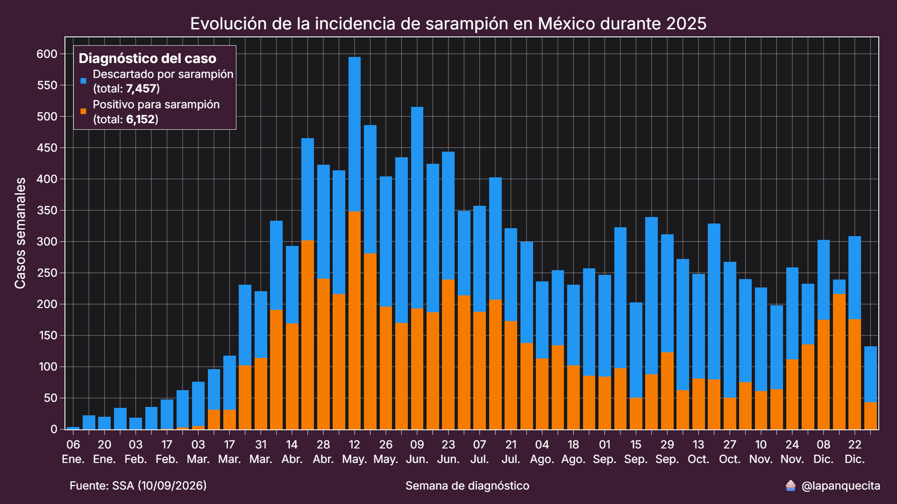

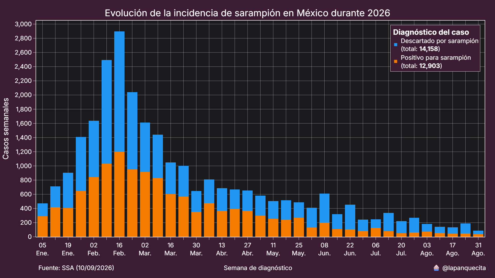

Siempre habrá una reducción en la última semana debido al rezago en la captura de registros.

Adicionalmente, esta información también está disponible en formato mensual, permitiendo un análisis complementario de las tendencias a lo largo del tiempo.

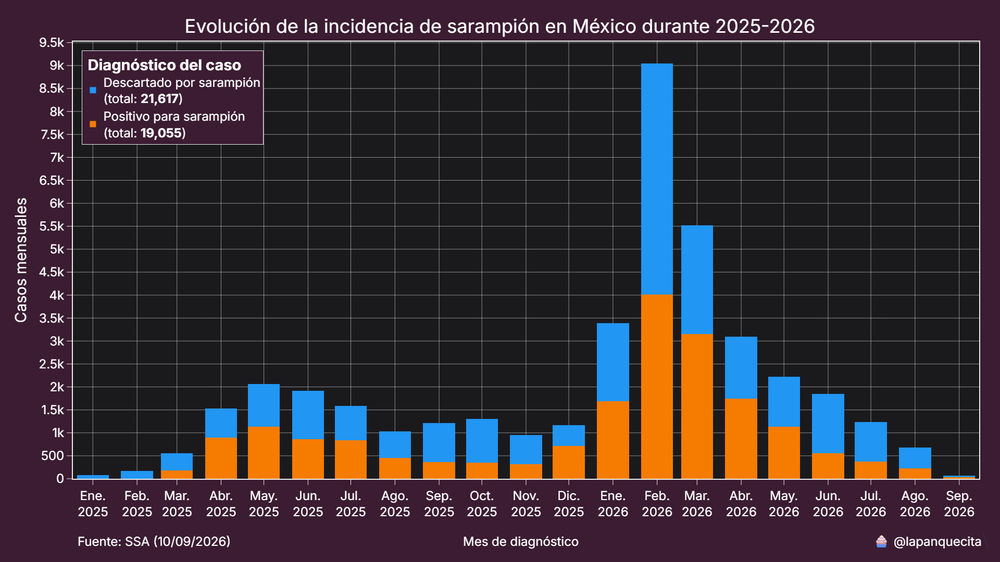

### Incidencia temporal según origen

La evolución de los casos positivos de sarampión se analiza semanalmente según su origen epidemiológico: importados, relacionados con importación, autóctonos y de fuente desconocida.

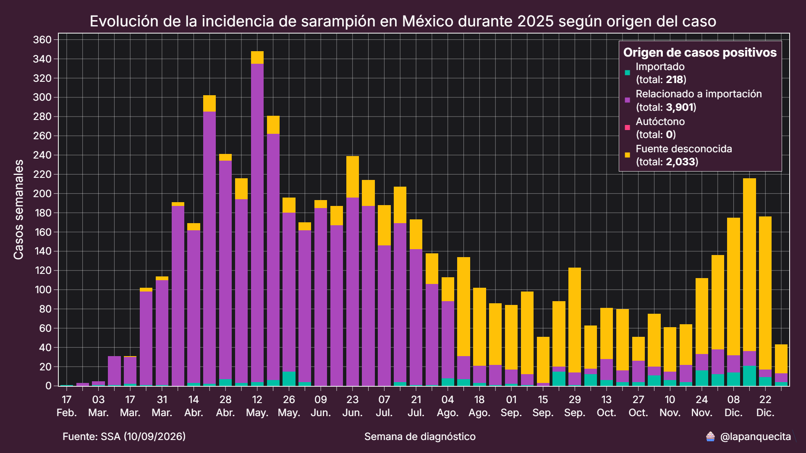

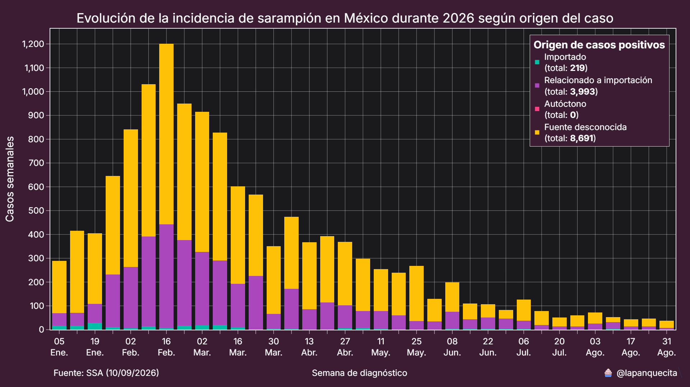

Se observa una disminución aparente en la última semana debido al rezago natural en la notificación de casos.

La información también está disponible en formato mensual, ofreciendo una visión agregada de las tendencias a lo largo del tiempo.

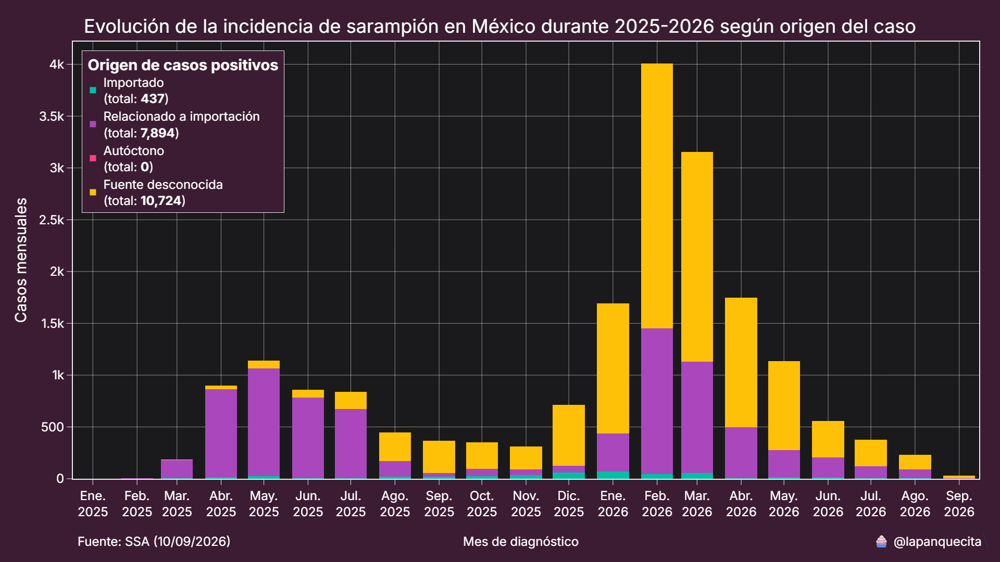

### Evolución de los casos confirmados

Para conocer cómo ha evolucionado cada caso confirmado de sarampión, se utiliza un diagrama de Sankey.

Este nos permite visualizar cuántas personas estaban vacunadas, cuántas no, y si hubo o no complicaciones en cada una de estas categorías, así como identificar si hubo un desenlace fatal.

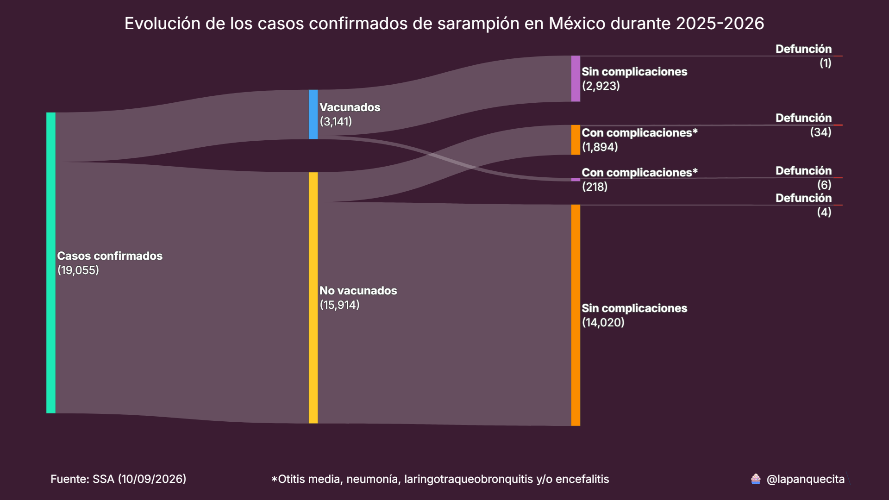

Para los nodos de defunción se aplicó un valor epsilon con el objetivo de que fueran perceptibles.

Cada nodo incluye el total de casos en cifras absolutas.

### Distribución de las defunciones

El número de defunciones por sarampión es relativamente bajo; no obstante, resulta fundamental identificar a los grupos poblacionales que se ven afectados.

Para este propósito, se utilizaron dos gráficas de tipo strip plot. En ellas, cada punto representa una observación individual; las tiras corresponden a cada sexo y la posición en el eje horizontal indica la edad.

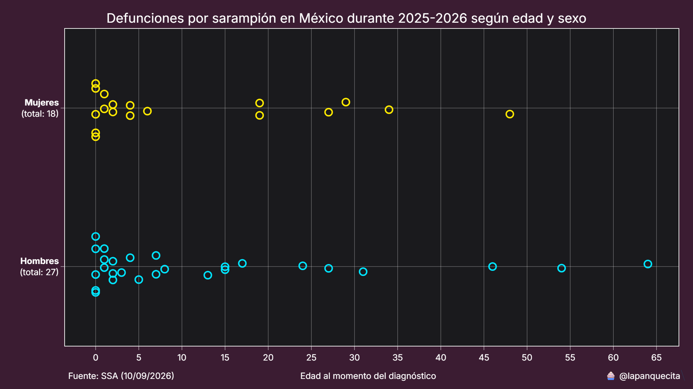

### Incidencia por edad y sexo

El sarampión no afecta por igual a todos los grupos de edad, y esto se demuestra con el siguiente gráfico de dispersión, que muestra la tasa de incidencia por grupos quinquenales de edad y sexo.

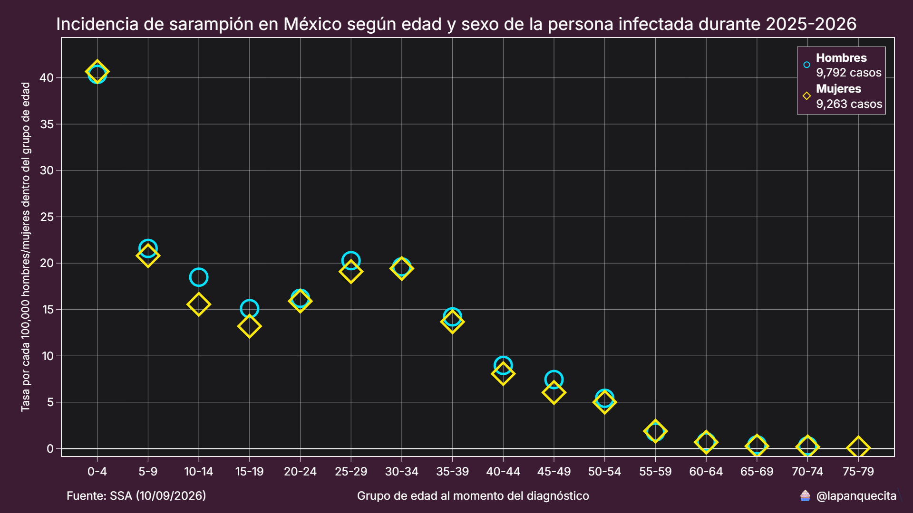

A medida que se recolectan más datos, las tendencias tienden a estabilizarse.

### Cobertura de vacunación

Expandiendo la gráfica anterior, esta visualización muestra la cobertura de vacunación por grupo de edad.

En lugar de usar grupos quinquenales, se optó por utilizar los grupos etarios designados por la SSA en sus anuarios de morbilidad.

A medida que se recolecten más datos, los intervalos de confianza se irán afinando y reflejarán mejor la variabilidad de las estimaciones.

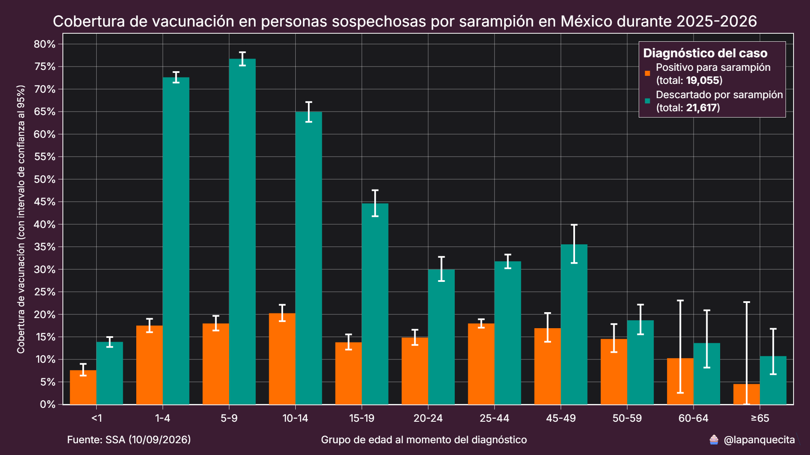

### Riesgo de casos severos de sarampión

Esta gráfica presenta los resultados de un modelo de Poisson con error estándar robusto, utilizado para estimar la probabilidad de desarrollar un caso severo de sarampión. El modelo está ajustado por la edad de la persona y su estado de vacunación.

Se eligió un modelo de Poisson con error robusto en lugar de un modelo logístico porque permite estimar riesgos relativos de manera directa y precisa cuando el evento **no es raro**, y el ajuste robusto corrige posibles desviaciones en la varianza.

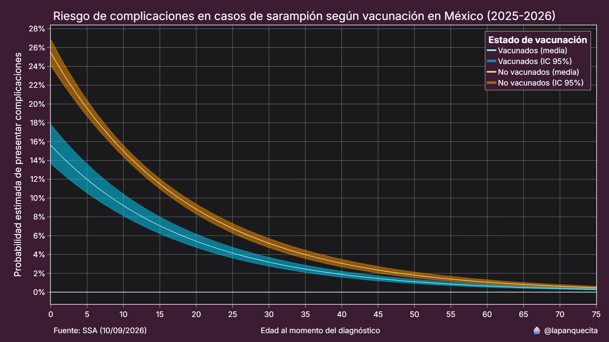

## Análisis geográfico

Esta sección presenta la distribución espacial del brote de sarampión en México a través de mapas y tablas municipales. Los mapas muestran la incidencia a distintos niveles —local, estatal y nacional— mientras que las tablas identifican los municipios con mayor carga de enfermedad, en términos absolutos o ajustados por población.

### Mapa de incidencia para una entidad

El brote comenzó en 2025 concentrándose en el estado de Chihuahua. El mapa a continuación ilustra la incidencia de casos confirmados durante el primer año del brote.

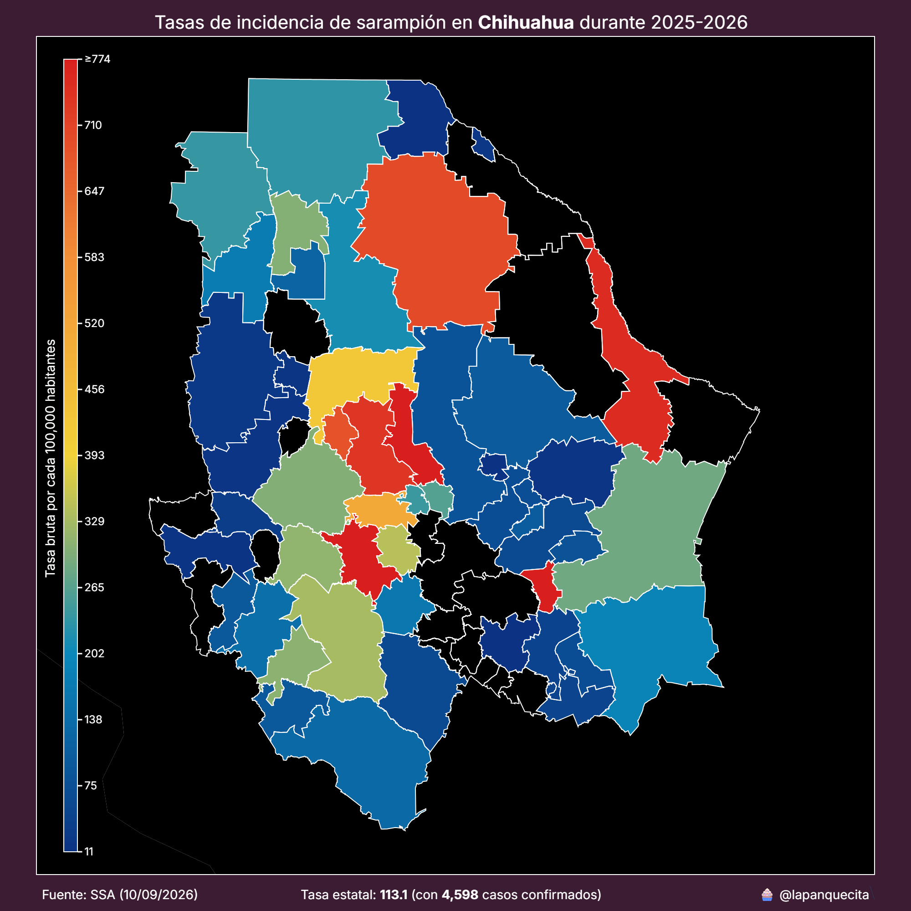

En 2026, se observó un foco emergente en el estado de Jalisco. Este mapa muestra la incidencia durante la expansión del brote hacia esta región.

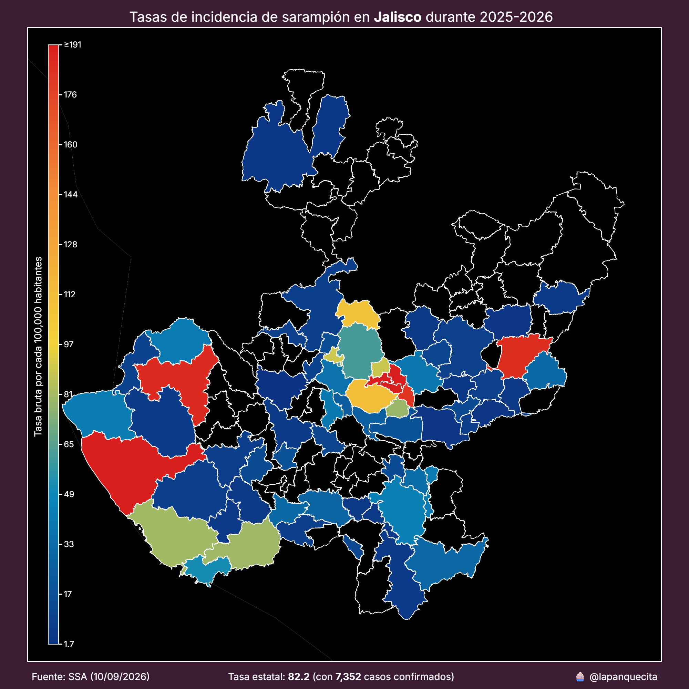

### Mapa de incidencia nacional

A nivel nacional, los mapas estatales permiten comparar la incidencia entre entidades y observar la propagación del brote a lo largo de 2025-2026.

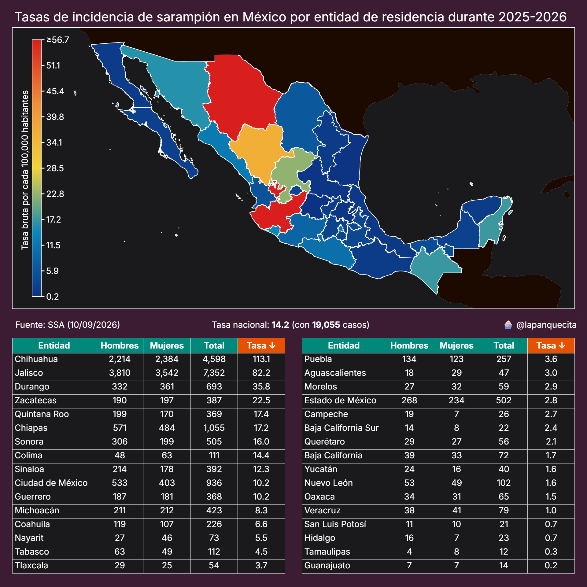

### Mapa de incidencia municipal

Finalmente, los mapas a nivel municipal muestran la incidencia con mayor resolución, facilitando la identificación de clústeres locales y áreas de atención prioritaria.

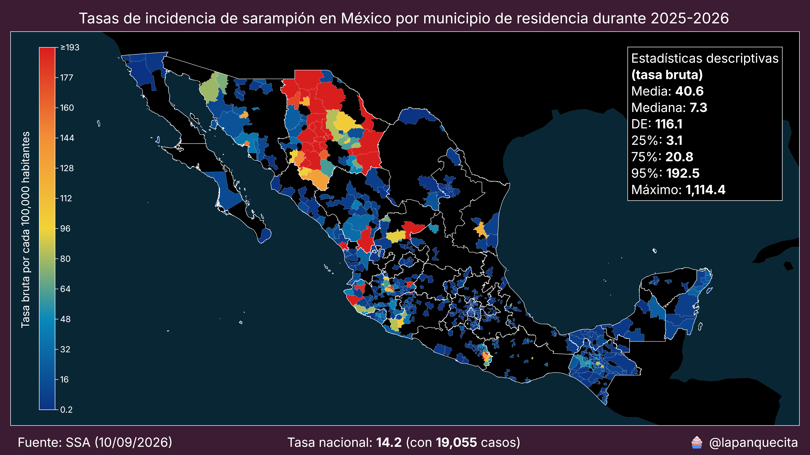

### Tablas de tasas e incidencias

Se generan tablas que muestran los 30 municipios con mayor incidencia de sarampión, ya sea a nivel nacional o filtradas por un estado específico. Los valores pueden presentarse en términos absolutos o ajustados por población, ofreciendo una visión precisa de los focos más afectados.

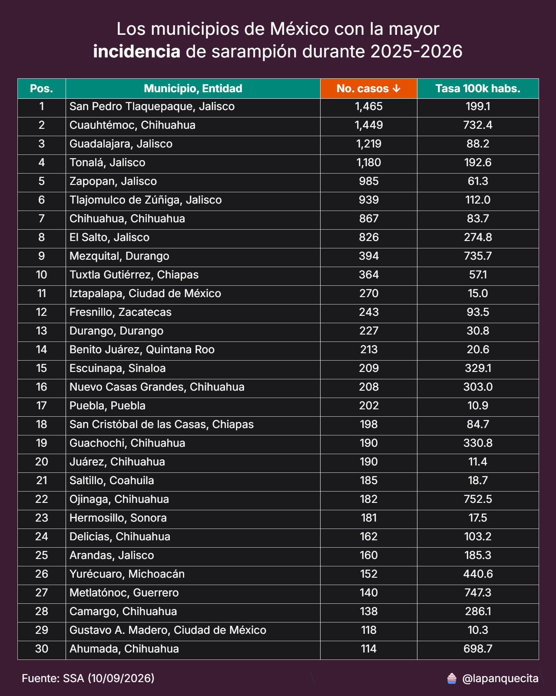

Estas tablas son útiles para orientar intervenciones focalizadas y priorizar recursos sanitarios a nivel municipal.

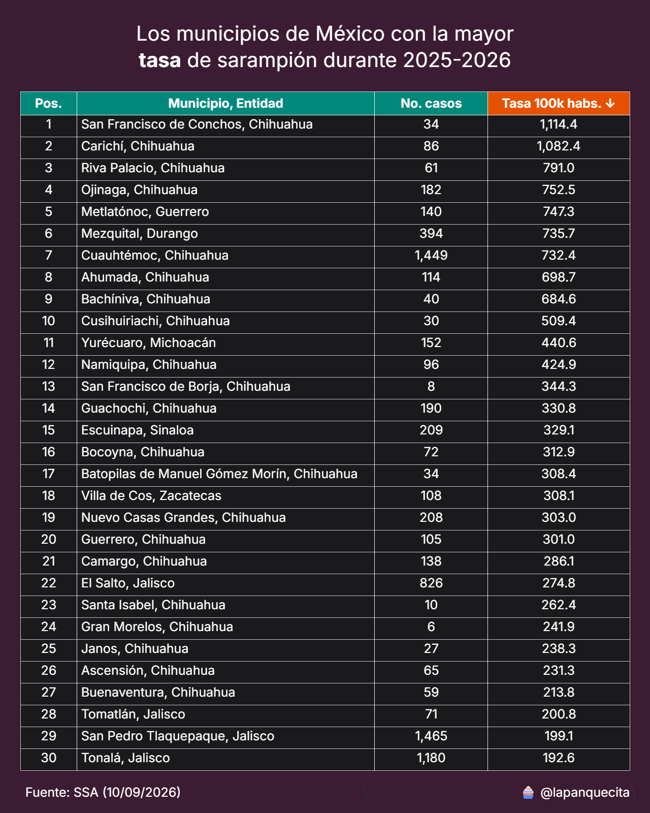

## Conclusión

Con la información disponible en los conjuntos de datos abiertos de la Secretaría de Salud, es posible comprender diversos aspectos del brote de sarampión en México.

Este repositorio se seguirá actualizando con los datos más recientes y nuevas visualizaciones conforme evolucione esta situación.
