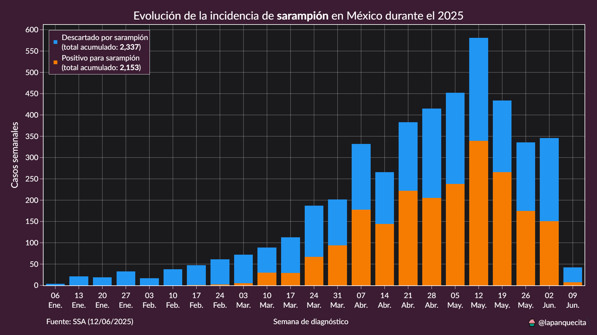
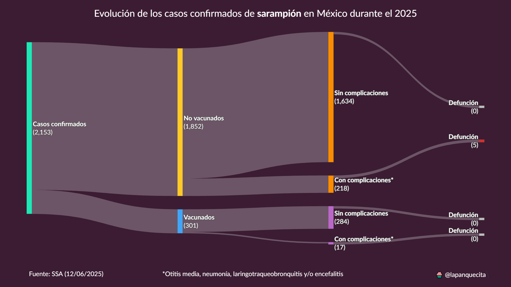
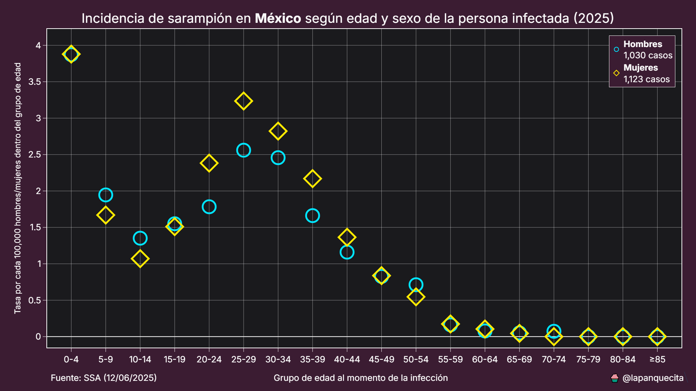
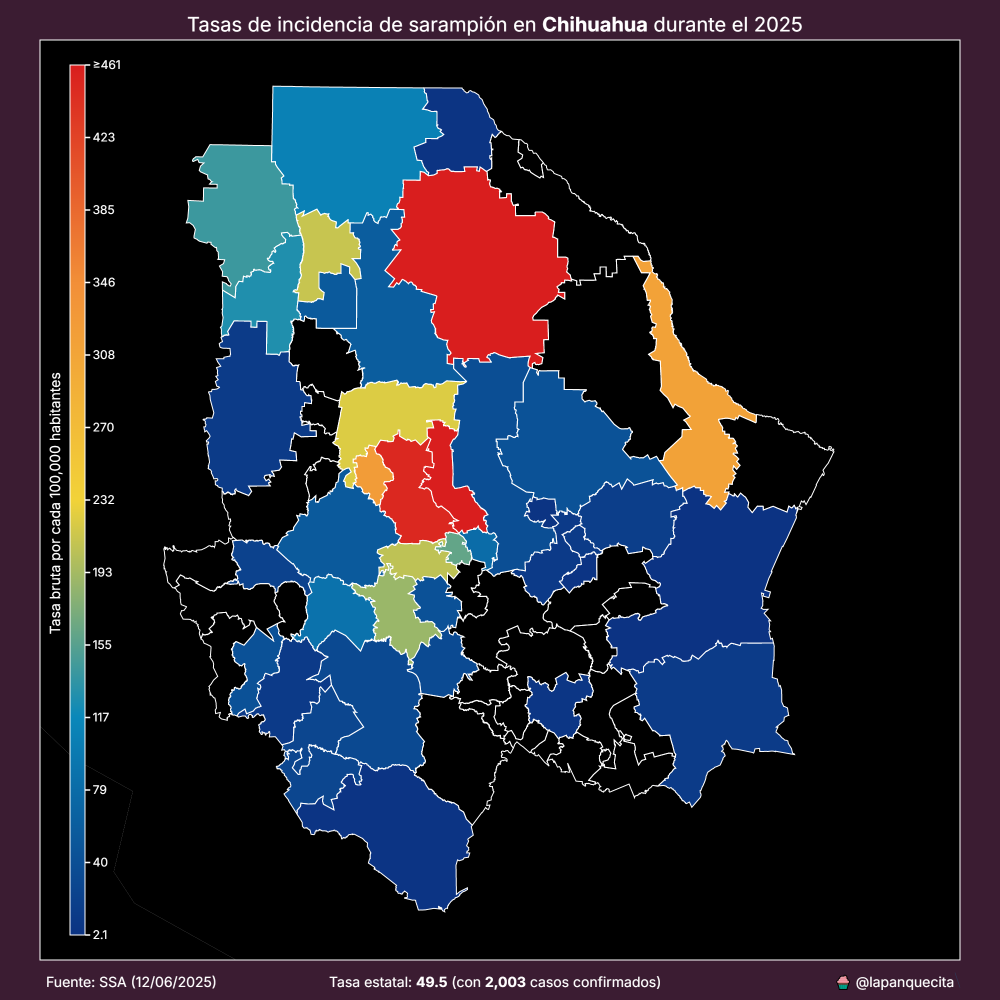
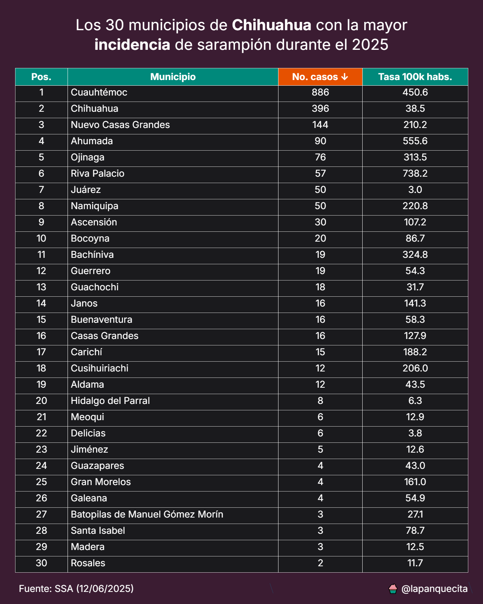

# Sarampión en México

El sarampión es una enfermedad viral altamente contagiosa causada por un virus del género *Morbillivirus*. Se transmite principalmente a través de gotitas en el aire al toser o estornudar.

Sus síntomas comienzan con fiebre alta, tos seca, secreción nasal y ojos enrojecidos, seguidos de una erupción rojiza que se extiende por todo el cuerpo. Aunque suele afectar principalmente a niños, puede presentarse a cualquier edad y provocar complicaciones en algunos casos.

En este repositorio se encuentran scripts y conjuntos de datos para analizar la incidencia de esta enfermedad en México.

Los datos provienen de la Secretaría de Salud: [https://www.gob.mx/salud/documentos/datos-abiertos-152127](https://www.gob.mx/salud/documentos/datos-abiertos-152127)

## Contexto histórico

Durante décadas, la propagación del sarampión se ha mantenido bajo control gracias a las altas tasas de vacunación. Sin embargo, esto cambió en 2025, cuando México experimentó un brote significativo, localizado en el estado de Chihuahua.

El contenido de este repositorio ayudará a entender esta situación desde varios ángulos.

## Contenido

* `script.py`: Script para generar diversas gráficas con datos a nivel nacional.
* `estatal.py`: Script para generar un mapa y una tabla de incidencia a nivel estatal.
* `requirements.txt`: Archivo que lista las librerías necesarias para ejecutar los scripts.
* Conjuntos de datos correspondientes a los años 202-2025, todos en formato CSV.

## Análisis

Las siguientes gráficas son generadas con los scripts antes mencionados.

### Tendencia semanal

El análisis comienza con la incidencia semanal de casos confirmados de sarampión por laboratorio.

Para esta gráfica de barras, definimos cada semana como el periodo de lunes a viernes. Esta decisión se tomó para facilitar la interpretación al público general.

Siempre habrá una reducción en la última semana debido al rezago en la captura de registros.

### Evolución de los casos confirmados

Para conocer cómo ha evolucionado cada caso confirmado de sarampión, se utiliza un diagrama de Sankey.

Este nos permite visualizar cuántas personas estaban vacunadas, cuántas no, y si hubo o no complicaciones en cada una de estas categorías, así como identificar si hubo un desenlace fatal.

Para los nodos de defunción se aplicó un valor epsilon con el objetivo de que fueran perceptibles.

Cada nodo incluye el total de casos en cifras absolutas.

### Incidencia por edad y sexo

El sarampión no afecta por igual a todos los grupos de edad, y esto se demuestra con el siguiente gráfico de dispersión, que muestra la tasa de incidencia por grupos quinquenales de edad y sexo.

A medida que se recolectan más datos, las tendencias tienden a estabilizarse.

### Mapa de incidencia

El brote de sarampión de 2025 se encuentra focalizado en el estado de Chihuahua, con aproximadamente el 95 % de los casos confirmados.

Para identificar si existe un patrón geográfico, se utiliza un mapa *choropleth*.

Este mapa representa la severidad de las tasas de incidencia mediante una escala de color que va del azul (bajo) al rojo (muy alto).

Por el momento, solo se incluye el archivo GeoJSON del estado de Chihuahua. Esto podría cambiar en caso de que la infección se extienda a otras entidades.

### Tabla de incidencia

Asimismo, se incluye una tabla sencilla que desglosa los 30 municipios más afectados del estado. La tabla presenta tanto las cifras absolutas como las tasas ajustadas por cada 100,000 habitantes.

Esta tabla también está disponible a nivel nacional.

### Conclusión

Con la información disponible en los conjuntos de datos abiertos de la Secretaría de Salud, es posible comprender diversos aspectos del brote de sarampión en México.

Este repositorio se seguirá actualizando con los datos más recientes y nuevas visualizaciones conforme evolucione esta situación.